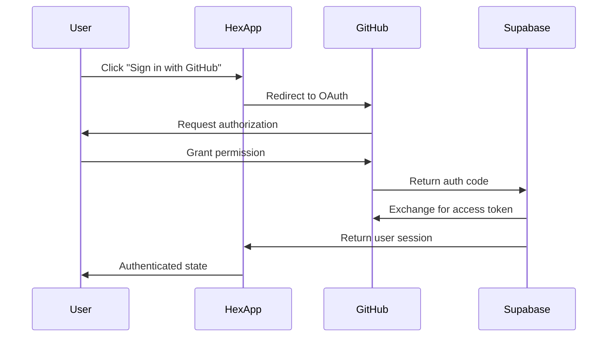

# Hex AI Authentication System

## Overview

Hex AI uses **GitHub OAuth** for authentication with **Supabase** as the backend service. This provides secure, seamless authentication while leveraging GitHub's trusted identity system for cybersecurity professionals.

## Architecture

```
User → GitHub OAuth → Supabase Auth → Hex AI App
```

### Components:
- **GitHub OAuth**: Identity provider
- **Supabase Auth**: Authentication service and user management
- **React Hook**: Frontend authentication state management
- **Database**: User profiles and subscription data

## Authentication Flow

### 1. Sign In Process



### 2. Session Management

- **Automatic refresh**: Supabase handles token refresh
- **Persistent sessions**: Users stay logged in across browser sessions
- **Secure storage**: Tokens stored in secure HTTP-only cookies

## Configuration

### Environment Variables

```env
# Supabase Configuration
VITE_SUPABASE_URL=your_supabase_project_url
VITE_SUPABASE_ANON_KEY=your_supabase_anon_key

# GitHub OAuth (configured in Supabase dashboard)
# No direct GitHub credentials needed in frontend
```

### Supabase Setup

1. **Create Supabase project**
2. **Enable GitHub provider** in Authentication settings
3. **Configure GitHub OAuth app**:
   - Authorization callback URL: `https://your-project.supabase.co/auth/v1/callback`
   - Homepage URL: Your app domain

### GitHub OAuth App Setup

1. **Create GitHub OAuth App** in GitHub Developer Settings
2. **Set callback URL**: `https://your-project.supabase.co/auth/v1/callback`
3. **Copy Client ID and Secret** to Supabase dashboard

## Database Schema

### Users Table (Supabase Auth)
```sql
-- Managed by Supabase Auth
auth.users (
  id UUID PRIMARY KEY,
  email TEXT,
  created_at TIMESTAMP,
  -- GitHub metadata in raw_user_meta_data
)
```

### Profiles Table (Custom)
```sql
-- Custom user profiles
public.profiles (
  id UUID REFERENCES auth.users(id) PRIMARY KEY,
  github_username TEXT,
  full_name TEXT,
  avatar_url TEXT,
  email TEXT,
  subscription_status TEXT DEFAULT 'free',
  created_at TIMESTAMP DEFAULT NOW(),
  updated_at TIMESTAMP DEFAULT NOW()
)
```

### Daily Usage Table
```sql
-- Track daily message usage
public.daily_usage (
  id UUID DEFAULT gen_random_uuid() PRIMARY KEY,
  user_id UUID REFERENCES auth.users(id),
  date DATE DEFAULT CURRENT_DATE,
  message_count INTEGER DEFAULT 0,
  created_at TIMESTAMP DEFAULT NOW(),
  UNIQUE(user_id, date)
)
```

## Frontend Implementation

### useAuth Hook

```typescript
const useAuth = () => {
  const [user, setUser] = useState(null);
  const [profile, setProfile] = useState(null);
  const [loading, setLoading] = useState(true);
  const [dailyUsage, setDailyUsage] = useState({ messageCount: 0, canSendMessage: true });

  // Authentication methods
  const signInWithGitHub = async () => {
    const { error } = await supabase.auth.signInWithOAuth({
      provider: 'github',
      options: {
        redirectTo: window.location.origin
      }
    });
  };

  const signOut = async () => {
    await supabase.auth.signOut();
  };

  // Usage tracking
  const incrementUsage = async () => {
    // Update daily message count
  };

  return {
    user,
    profile,
    isAuthenticated: !!user,
    isPremium: profile?.subscription_status === 'premium',
    canSendMessage: dailyUsage.canSendMessage,
    dailyUsage,
    signInWithGitHub,
    signOut,
    incrementUsage,
    loading
  };
};
```

### Authentication Components

#### AuthButton (Header)
- **Desktop**: Shows minimal user indicator
- **Mobile**: Hidden (functionality moved to profile modal)

#### AuthCard (Desktop Sidebar)
- **Profile information**: Avatar, username, email
- **Subscription status**: Free vs Premium badge
- **Daily usage**: Message count and limits
- **Sign out button**: Direct logout functionality

#### Mobile Profile Modal
- **Complete profile info**: All user details
- **Usage tracking**: Daily message limits
- **Upgrade button**: Link to billing
- **Sign out**: Logout functionality

## User States

### 1. Unauthenticated
```typescript
{
  user: null,
  profile: null,
  isAuthenticated: false,
  canSendMessage: false
}
```

### 2. Free User
```typescript
{
  user: { id, email, ... },
  profile: { subscription_status: 'free', ... },
  isAuthenticated: true,
  isPremium: false,
  canSendMessage: dailyUsage.messageCount < 3
}
```

### 3. Premium User
```typescript
{
  user: { id, email, ... },
  profile: { subscription_status: 'premium', ... },
  isAuthenticated: true,
  isPremium: true,
  canSendMessage: true // Always true for premium
}
```

## Usage Limits

### Free Tier
- **3 messages per day**
- **Resets at midnight UTC**
- **Upgrade prompt** when limit reached

### Premium Tier ($3/month)
- **Unlimited messages**
- **No daily restrictions**
- **Priority support**

## Security Features

### 1. OAuth Security
- **No password storage**: Uses GitHub's secure authentication
- **Scope limitations**: Only requests necessary permissions
- **Token rotation**: Automatic refresh handling

### 2. Database Security
- **Row Level Security (RLS)**: Users can only access their own data
- **API key protection**: Anon key has limited permissions
- **Secure endpoints**: All auth operations through Supabase

### 3. Frontend Security
- **No sensitive data**: No tokens stored in localStorage
- **Secure redirects**: Validated callback URLs
- **HTTPS only**: All authentication over secure connections

## Error Handling

### Common Scenarios
1. **Network errors**: Retry with exponential backoff
2. **Session expired**: Automatic redirect to login
3. **Rate limiting**: Graceful degradation
4. **OAuth failures**: Clear error messages

### Error States
```typescript
// Authentication errors
{
  type: 'auth_error',
  message: 'Please sign in to continue',
  retryable: false
}

// Usage limit errors
{
  type: 'usage_limit',
  message: 'Daily limit reached. Upgrade to Premium for unlimited access.',
  retryable: false
}
```

## Development vs Production

### Development
- **Local Supabase**: Can use local instance
- **Test GitHub OAuth**: Separate OAuth app for development
- **Debug logging**: Detailed auth state logging

### Production
- **Production Supabase**: Live project with proper security
- **Production OAuth**: Main GitHub OAuth app
- **Error tracking**: Sentry or similar for auth errors

## Troubleshooting

### Common Issues

1. **"Invalid redirect URI"**
   - Check GitHub OAuth app callback URL
   - Ensure Supabase callback URL matches

2. **"User not found"**
   - Profile creation trigger may have failed
   - Check Supabase database functions

3. **"Session expired"**
   - Token refresh failed
   - Clear browser storage and re-authenticate

4. **"Daily limit reached"**
   - Check daily_usage table
   - Verify date calculations (timezone issues)

### Debug Commands
```sql
-- Check user profile
SELECT * FROM profiles WHERE id = 'user-uuid';

-- Check daily usage
SELECT * FROM daily_usage WHERE user_id = 'user-uuid' AND date = CURRENT_DATE;

-- Reset daily usage (development only)
DELETE FROM daily_usage WHERE user_id = 'user-uuid' AND date = CURRENT_DATE;
```

## Future Enhancements

### Planned Features
1. **Multi-provider auth**: Google, Microsoft OAuth
2. **Team accounts**: Organization-level subscriptions
3. **API keys**: Programmatic access for power users
4. **SSO integration**: Enterprise single sign-on

### Security Improvements
1. **2FA support**: Two-factor authentication
2. **Session monitoring**: Unusual activity detection
3. **Audit logging**: Comprehensive access logs
4. **Device management**: Trusted device tracking

---

*This documentation covers the complete authentication system for Hex AI. For implementation details, see the source code in `/src/hooks/use-auth.ts` and related components.*
